# 📊 CartratBot — Telegram-бот для учёта расходов на автомобиль

> 🎓 **Курсовая работа**
> **Тема:** Разработка системы учёта расходов на автомобиль с использованием Telegram-бота и PostgreSQL

---

## Кратко о проекте

**CartratBot** — Telegram-бот для удобного учёта трат, связанных с эксплуатацией автомобиля: выбор марки/модели, присвоение «клички» машине, фиксация расходов (заправка, ремонт, прочее), автоматический расчёт стоимости топлива и просмотр истории/статистики. Все данные хранятся в локальной базе PostgreSQL.

---

## Стек технологий и назначение

* **Python 3.12** — основной язык реализации.
* **Poetry** — управление зависимостями и виртуальным окружением.
* **pyTelegramBotAPI (импортируется как `telebot`)** — работа с Telegram Bot API (обработка сообщений, inline/reply клавиатуры).
* **psycopg2 / psycopg2-binary** — адаптер Python ↔ PostgreSQL (выполнение SQL-запросов).
* **PostgreSQL** — реляционная СУБД для хранения пользователей, автомобилей и расходов.
* **pgAdmin 4** — графический интерфейс для администрирования БД, выполнения SQL-запросов и аналитики.
* Дополнительно: утилиты для конфигурации (.env / config.py), логирование, скрипты и т.п.

---

## Связи в базе данных (коротко)

В БД реализованы основные сущности (в зависимости от реализации названия таблиц могут отличаться):

```markdown
### Схема базы данных
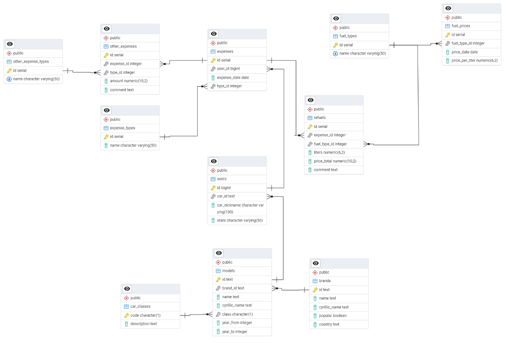

### Примеры запросов (pgAdmin)
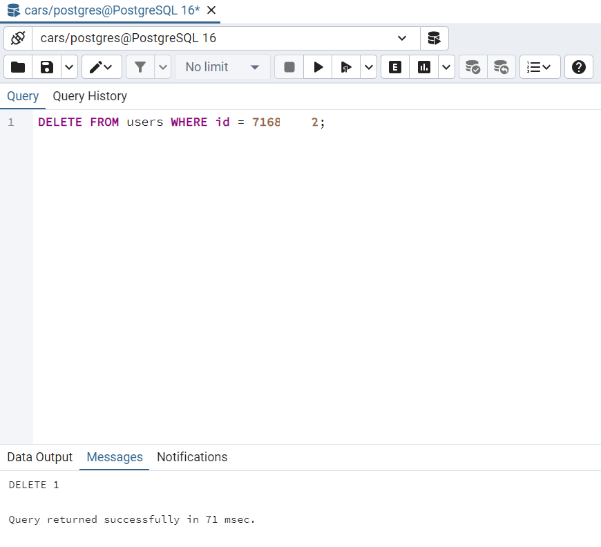
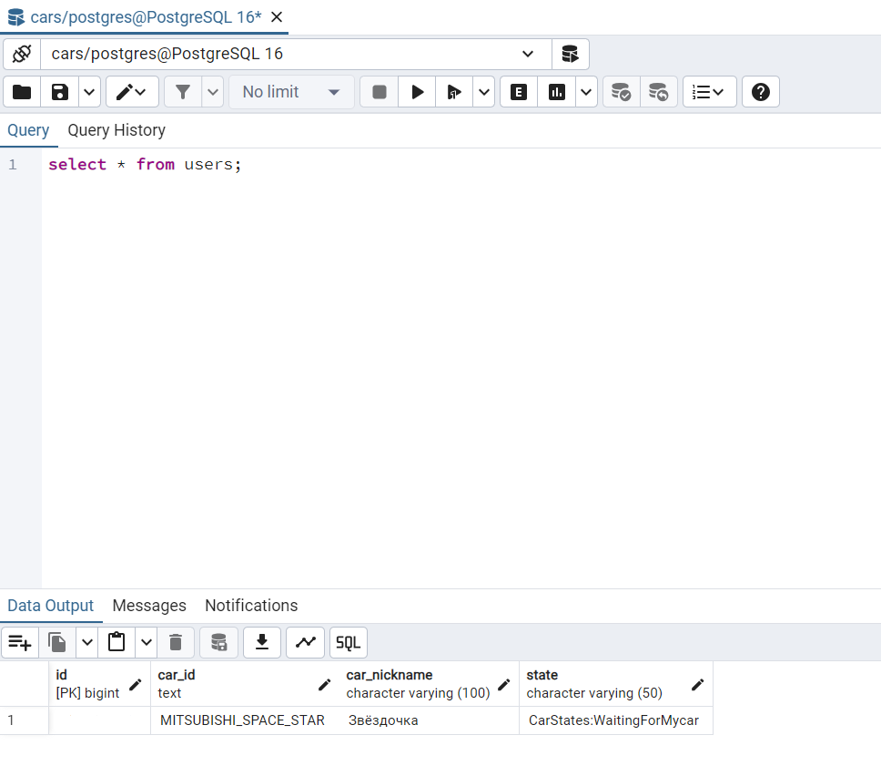
```
---

## Установка и настройка (локально)

### 1. Клонирование репозитория

```bash
git clone https://github.com/og3gor/CartratBot.git
cd CartratBot
```

### 2. Установка зависимостей через Poetry

```bash
poetry install
```
### 3. Создать бота в Telegram

1. В Telegram откройте `@BotFather`.
2. Выполните команду `/newbot` и следуйте инструкциям (дайте имя и username).
3. Сохраните выданный **TOKEN** — он понадобится в конфиге.

### 4. Создать файл конфигурации `config.py`

В каталоге `src/cartratbot/` (или в другом месте, если проект настроен иначе) создайте файл `config.py` с параметрами указанными в файле конфигурации с приставкой _exemple

### 5. Инициализация / восстановление БД

В репозитории есть папка `postgres_data` — восстановите базу согласно инструкциям проекта (или через pgAdmin / psql импортируйте дамп).

---

## Запуск бота

### Рекомендуемый (Poetry)

```bash
poetry run python src/cartratbot/main.py
```

### Запуск в VSCode

 `Ctrl+Shift+P` → `Python: Select Interpreter` → выберите интерпретатор виртуального окружения Poetry (`poetry env info --path` покажет путь).

---

## Работа с базой и аналитика через pgAdmin4

1. Запустите pgAdmin4.
2. Подключитесь к локальному серверу PostgreSQL (Host: `localhost`, Port: `5432`, user/password — из `config.py`).
3. Через **Query Tool** выполняйте запросы для аналитики. Примеры:

```sql
-- общее число пользователей
SELECT COUNT(*) FROM users;

-- количество пользователей по автомобилям
SELECT car_id, COUNT(*) AS users_count FROM users GROUP BY car_id ORDER BY users_count DESC;

-- суммарные расходы по пользователю
SELECT user_id, SUM(amount) AS total_spent
FROM expenses
GROUP BY user_id
ORDER BY total_spent DESC;
```

---

## Пример использования / демонстрация


```markdown
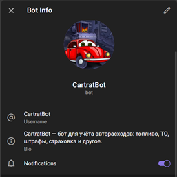
При первом заходе в бота предлагается запустить его командой /start для начала переписки (работы):

При запуске CartratBot ответит приветственным сообщением и предложит последующие функции, а также выведет вспомогательные клавиши управления «🏎️Моя машина» 
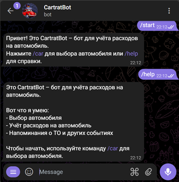


После предложив поиск, если мы нажмём «🔍Поиск марки», бот предложит нам марки и модели:


Если у пользователя есть особое (уникальное) название своей машины бот, его можно вписать или же пропустить (для этого в клавиатуре будет клавиша «Пропустить»)
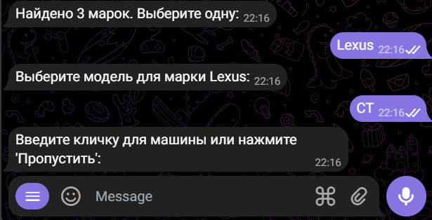
После выбора авто, оно отобразиться и присвоиться пользователю, а блок клавиш смениться на действия с данным автомобилем:
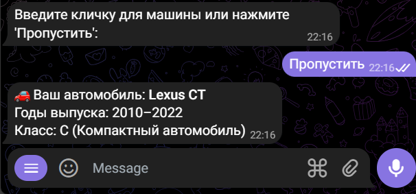
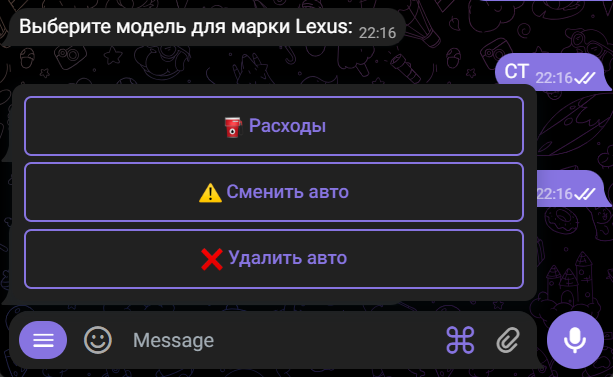
При вводе пользователем расхода ему следует выбрать клавишу «⛽Расходы», после выбрать что за расход, в какой день и ввести потраченную сумму, а также при необходимости комментарий: 
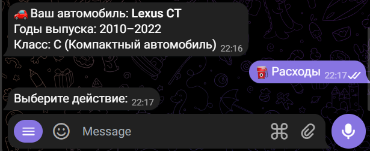

Допустим пользователь выбрал заправку, тогда бот предложит ему выбрать тип топлива, и количество литров, после по актуальным данным стоимости топлива (за литр, за кубометр, за киловатт – зависит от выбранного топлива) подсчитает потраченную пользователем сумму.

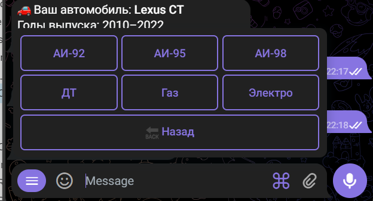


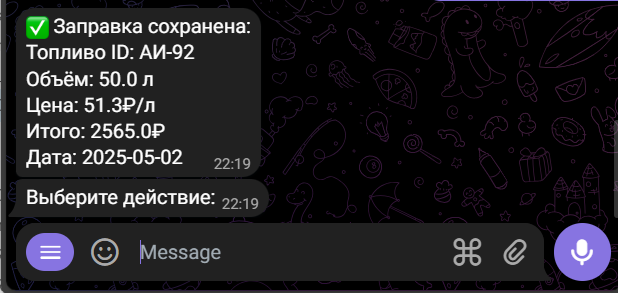
После введения расходов пользователь может посмотреть всю историю трат на свой автомобиль, а также сумму всех потраченных средств.
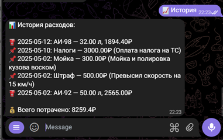
```

---

